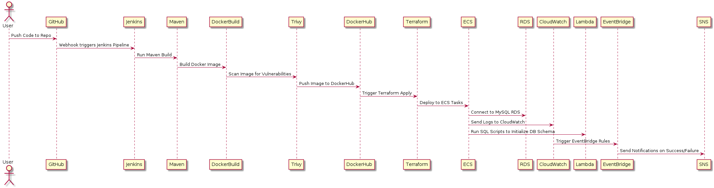

# Spring Boot-React App Deployment and Infrastructure Setup

## Table of Contents
1. [Introduction](#introduction)
2. [Architecture Overview](#architecture-overview)
   - [Single Container Application](#single-container-application)
   - [Cloud Infrastructure on AWS ECS](#cloud-infrastructure-on-aws-ecs)
   - [Scaling and Alternatives](#scaling-and-alternatives)
   - [Database Choice: RDS MySQL](#database-choice-rds-mysql)
3. [CI/CD Pipeline with Jenkins](#ci-cd-pipeline-with-jenkins)
4. [Infrastructure as Code (IaC) with Terraform](#infrastructure-as-code-iac-with-terraform)
   - [Workspaces and Modules](#workspaces-and-modules)
   - [Resource Grouping](#resource-grouping)
   - [Monitoring and Alarms](#monitoring-and-alarms)
   - [Terraform Providers](#terraform-providers)
   - [Challenges](#challenges)
5. [Instructions to Fork, Configure, and Deploy](#instructions-to-fork-configure-and-deploy)
6. [Testing the Application](#testing-the-application)
7. [Instructions to Tear Down the Infrastructure](#instructions-to-tear-down-the-infrastructure)
8. [Conclusion](#conclusion)

---

## Introduction

This guide provides a comprehensive overview of deploying a Spring Boot backend and React frontend application on AWS using a containerized architecture with **Amazon ECS on Fargate**. The infrastructure is managed through **Terraform**, with a CI/CD pipeline implemented via **Jenkins**. The pipeline ensures seamless provisioning, deployment, and scaling of the app across **dev**, **staging**, and **prod** environments.

---

## Architecture Overview
# CI/CD Pipeline Architecture


#### Complete Infrastructure Workflow:


### Single Container Application

The Spring Boot backend and React frontend are bundled into a **single container**. This approach simplifies deployment and resource management by running both the backend and frontend in the same runtime environment. Key reasons for using a single container include:

- **Simplified Deployment**: Reduces the complexity of managing multiple containers.
- **Tight Coupling**: Eliminates networking overhead between the frontend and backend.
- **Resource Optimization**: Reduces the cloud resource footprint, helping to minimize costs.

### Cloud Infrastructure on AWS ECS

The application is deployed on **Amazon ECS (Elastic Container Service)** using **Fargate**, a serverless container management service.

- **Why ECS on Fargate?**
  - **Serverless**: Fargate abstracts infrastructure management, reducing operational overhead.
  - **Cost Efficiency**: You pay only for the resources your container tasks use.
  - **Scalability**: ECS automatically scales container tasks based on demand.

- **ECS Autoscaling**:
  - The application is configured to scale from a minimum of 1 task to a maximum of 5 tasks. The desired count is set to 1 to optimize costs when idle, but it scales up during high traffic.

### Scaling and Alternatives

- **EKS** (Elastic Kubernetes Service) could provide more advanced orchestration features, but it requires more management and complexity.
- **Elastic Beanstalk** abstracts infrastructure but offers less granular control.

**Why ECS?**  
ECS offers the best balance between flexibility and simplicity, making it ideal for a containerized workload, especially when paired with Fargate for serverless deployments.

### Database Choice: RDS MySQL

The application was migrated from the default **H2 in-memory database** to **Amazon RDS MySQL** for production.

- **Why RDS MySQL?**
  - **Managed Service**: AWS handles backups, patching, and replication, reducing the operational burden.
  - **Scalability**: RDS MySQL can scale up as demand increases.
  - **High Availability**: With Multi-AZ configurations, RDS ensures minimal downtime.

Additionally, an **AWS Lambda** function is triggered to initialize the database schema by running SQL scripts when the RDS instance is provisioned.

---

## CI/CD Pipeline with Jenkins

I implemented a **Jenkins-based CI/CD pipeline** to automate the build, test, and deployment process for each environment: **dev**, **staging**, and **prod**.

### Key Features

1. **Separate Pipelines for Each Environment**:  
   I created individual Jenkins pipelines (`Jenkinsfile.dev`, `Jenkinsfile.staging`, and `Jenkinsfile.prod`) to manage and maintain each environment separately.

2. **Stages in Each Pipeline**:
   - **Checkout Code**: Jenkins pulls the latest code from the repository.
   - **Run Tests**: Basic unit tests are executed using Maven.
   - **Build Docker Image**: The application is packaged into a Docker image.
   - **Security Scan**: Docker images are scanned for vulnerabilities using **Trivy**.
   - **Push to DockerHub**: The Docker image is pushed to DockerHub.
   - **Deploy with Terraform**: The application is deployed to ECS using Terraform, which provisions the necessary infrastructure.
   - **Update ECS Service**: The ECS service is updated with the new image and task definition.

3. **Manual Approval for Production**:  
   The **prod pipeline** requires manual approval before deployment to ensure sensitive changes are reviewed.

4. **Dynamic Build Agents**:  
   To optimize Jenkins, I recommend using **dynamic build agents** with **AWS Auto Scaling Groups**. This allows Jenkins to scale its agents dynamically based on load, ensuring efficient resource utilization. I have previously written about this and detailed instructions can be found in this [article](https://practicalcloud.net/how-to-configure-dynamic-build-agents-in-jenkins-using-aws-and-terraform/).

---

## Infrastructure as Code (IaC) with Terraform

I utilized **Terraform** to manage the cloud infrastructure, following Terraform best practices to ensure modularity, maintainability, and scalability.

### Workspaces and Modules

1. **Workspaces**:  
   Separate workspaces (`dev`, `staging`, `prod`) allow isolated environments while keeping the infrastructure code consistent across all environments.

2. **Modules**:  
   The infrastructure is divided into the following **7 modules**:
   - **VPC**: Provisions networking components such as subnets, route tables, NAT gateways, and Internet gateways.
   - **ALB**: Manages the Application Load Balancer.
   - **ECS**: Manages the ECS cluster and services.
   - **Security Groups**: Manages security group configurations for ECS, RDS, and Lambda.
   - **RDS**: Provisions the RDS MySQL instance.
   - **ECS Auto-scaling**: Configures ECS service auto-scaling.
   - **Monitoring**: Sets up CloudWatch alarms, SNS topics, and dashboards.

### Resource Grouping

All resources provisioned by Terraform are organized into **resource groups** to simplify access management. This approach allows easier administration and the ability to control access based on user roles or groups.

### Monitoring and Alarms

- **CloudWatch Metrics and Alarms**:  
  The **Monitoring Module** provisions key CloudWatch metrics and alarms that monitor application performance and infrastructure health. Alarms are set for critical resource utilization such as CPU, memory, and error rates.

- **CloudWatch EventBridge Rules**:  
  EventBridge rules trigger alerts based on application state changes or failures. These are linked to SNS topics to notify the team.

- **SNS Topics for Alerts**:  
  The **Simple Notification Service (SNS)** is used to deliver alerts triggered by alarms or event rules. This ensures timely notifications of any issues.

- **CloudWatch Dashboard**:  
  A custom CloudWatch dashboard provides a real-time overview of all key metrics, allowing for easy monitoring and troubleshooting.

### Terraform Providers

- **Remote State Management**:
   - The `providers.tf` file includes **hardcoded S3 bucket** and **DynamoDB table** names for remote state storage. You **must update** the S3 bucket and DynamoDB table to your own values before deploying the infrastructure:
     ```hcl
     backend "s3" {
       bucket = "<your-bucket-name>"
       dynamodb_table = "<your-dynamodb-table>"
     }
     ```

### Challenges

- **Lambda and VPC ENI Delay**:  
   Tearing down the infrastructure takes about **30-35 minutes** due to known delays with Lambda ENI behavior when connected to VPCs. You can read more about this issue in the [Terraform issue tracker](https://github.com/hashicorp/terraform-provider-aws/issues/32130).

---

## Instructions to Fork, Configure, and Deploy

1. **Fork the Repository**:
   - Fork the GitHub repository to your account and clone it locally:
     ```bash
     git clone https://github.com/<your-username>/<repo-name>.git
     cd <repo-name>
     ```

2. **Create an Ubuntu EC2 Instance**:
   - Launch an Ubuntu EC2 instance with a **minimum 30GB EBS volume** to act as the Jenkins controller.
   - Attach this **[user data script](./jenkins-user-data-script.sh)** to install necessary tools such as Terraform, Docker, Maven, AWS CLI, and Trivy.

3. **Access Jenkins**:
   - Once the EC2 instance is running, connect to Jenkins on port **8080**.

4. **Install Jenkins Plugins**:
   - Install Jenkins’ suggested plugins and additional plugins such as:
     - Git
     - Docker Pipeline
     - AWS Credentials
     - Credentials Binding
     - SNS Build Notifier
     - Pipeline Utility Steps

5. **Add Credentials in Jenkins**:
   - Navigate to `Jenkins > Manage Jenkins > Manage Credentials` and add

 the following credentials:
     - `aws-access-key-id`, `aws-secret-access-key`, `sns-email-address`, `db-username-dev`, `db-password-dev`, `db-username-staging`, `db-password-staging`, `db-username-prod`, and `db-password-prod`. The credentials should be of type **Secret text**. Make sure that you set the credential IDs exactly as is written here.
   - Add DockerHub credentials with the ID **docker**. This should be of type **Username/Password**.

6. **Configure Docker Registry**:
   - Go to `Jenkins > Manage Jenkins > System > Declarative Pipeline (Docker)` and configure DockerHub registry credentials.

7. **Create Jenkins Pipelines**:
   - Create three separate pipelines for **dev**, **staging**, and **prod**. Use **Build with Parameters** and enter the `IMAGE_NAME` parameter, which is the Docker image name (e.g., `username/spring-boot-app`).

8. **Important Note**:
   - The `providers.tf` file contains **hardcoded S3 bucket** and **DynamoDB table** values. Update these to match your own:
     ```hcl
     backend "s3" {
       bucket = "<your-bucket-name>"
       dynamodb_table = "<your-dynamodb-table>"
     }
     ```

---

## Testing the Application

Once the application is deployed, you can test it in two ways:

1. **Using CURL to Test the API**:
   - You can test the Spring Boot REST API by running the following `curl` command:
     ```bash
     curl -v -u greg:turnquist http://<ALB-DNS-NAME>/api/employees/3
     ```
     This command fetches the employee details from the API.

2. **Accessing the Frontend**:
   - The **ALB DNS name** is output by Terraform after the deployment is completed. You can visit the DNS name in your browser to access the frontend.
   - The frontend will display a **login page**. Use the credentials `greg:turnquist` to log in and access the application.

---

## Instructions to Tear Down the Infrastructure

1. **Navigate to the Terraform Directory**.

2. **Switch to the Appropriate Workspace**:
   ```bash
   terraform workspace select dev
   ```

3. **Run the Destroy Command**:
   ```bash
   terraform destroy -auto-approve -var-file=dev.tfvars
   ```
   - Use `staging.tfvars` or `prod.tfvars` for other environments.

---

## Conclusion

By following this guide, you can efficiently deploy and manage a Spring Boot and React application on AWS using **Docker**, **Terraform**, and **Jenkins**. This setup ensures a scalable and maintainable infrastructure that supports continuous delivery and automated scaling, while also enabling robust monitoring and alerting.

---

Connect with me on [LinkedIn](https://www.linkedin.com/in/kelvin-onuchukwu-3460871a1?lipi=urn%3Ali%3Apage%3Ad_flagship3_profile_view_base_contact_details%3ByiGHZNnXReayzc9G2WjJ9w%3D%3D)

Follow and Subscribe to my blog [Practical Cloud](https://practicalcloud.net/deploy-production-ready-apps-on-amazon-ecs-a-complete-guide/)
